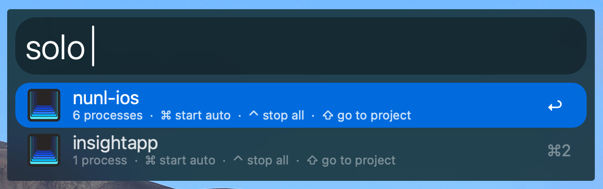
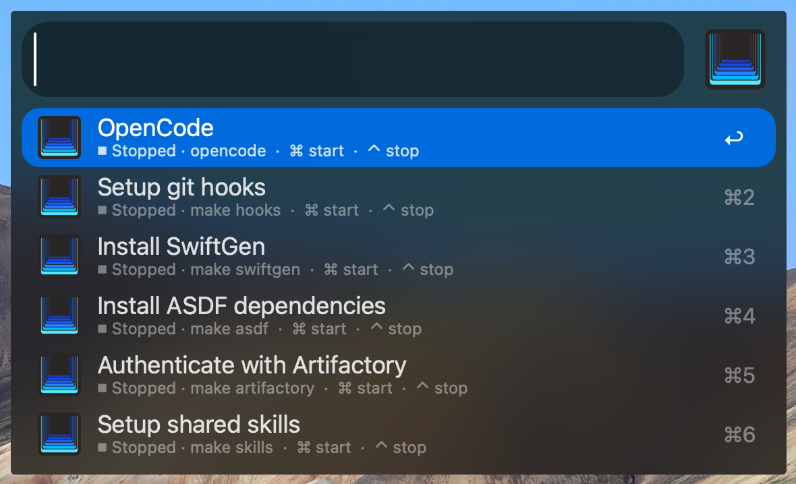
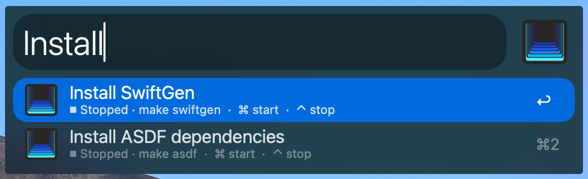
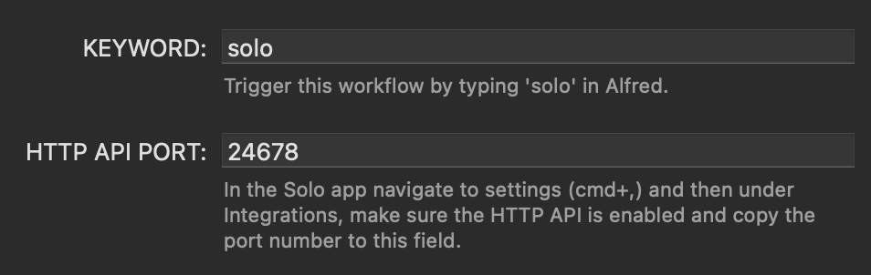

# Solo - Alfred Workflow
 
Browse and control your [Solo](https://soloterm.com) projects and processes directly from Alfred.
 
## Compatibility
 
This workflow has been tested against **Solo v0.5.9**. When using a newer version, functionality could break. Please report any bugs by sending an email to lloyd@appsbylloyd.com.
 
## Prerequisites
 
- **Solo** installed and running — [soloterm.com](https://soloterm.com)
- **HTTP API enabled** in Solo under Settings → Integrations
- **Port number** copied from that same settings screen into the `HTTP_API_PORT` field in this workflow's configuration (click the `[x]` icon in the top-right corner of the workflow in Alfred Preferences)
 
## Usage
 
Type `solo` in Alfred to get started.
 
### Project list
 
- `Enter` — Drill down into the project's processes
- `⌘ Enter` — Start all auto-start processes
- `⌃ Enter` — Stop all processes
- `⇧ Enter` — Go to project

 
### Process list
 
- `Enter` — Navigate to the process
- `⌘ Enter` — Start process (or Restart if already running)
- `⌃ Enter` — Stop process (disabled if already stopped)

 
You can type to filter the process list after selecting a project.

 
## Workflow Configuration
 
Open the workflow configuration by clicking the `[x]` icon in the top-right corner of the workflow in Alfred Preferences.
 
- `KEYWORD` — Trigger this workflow by typing this value in Alfred (defaults to `solo`)
- `HTTP_API_PORT` — Port number of the Solo HTTP API, found in Solo → Settings → Integrations

